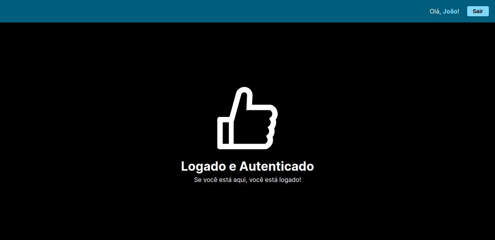

# jwt-login-validation

Uma aplicação de login com autenticação JWT desenvolvida com Next, Express, Sequelize, MySQL e Docker Compose

## O que é

O projeto foi desenvolvido com o objetivo de treinar os conhecimentos de JSON WEB Token e aplica-lo em todo o processo de entrar ou cadastrar em um site e páginas protegidas.

As rotas `/signin` e `/signup` são respectivamente formulários de login e criação de conta, contendo validações e mensagens de erro para os campos feitas no front-end para que os dados sejam enviados para o back-end já tratados e evite requisições desnecessárias, e também validações no back-end que são retornadas e exibidas pelo front-end.

A rota `/` é uma rota protegida que o usuário só pode acessar se estiver logado e caso não esteja é redirecionado para a página de login

## Tecnologias utilizadas
- Next
- Express
- Sequelize
- MySQL
- Docker e Docker Compose
- Dockerfile e compose.yaml
- Joi
- jsonwebtoken
- bcryptjs

## Como executar

1. Renomeie o arquivo `.env.example` para `.env` e defina os valores das variáveis de ambiente
> Os valores que já vem nas variáveis de ambientes já são válidos para execurtar a aplicação com sucesso

2. Na raiz do projeto execute `docker compose up -d`

3. Pronto! No seu navegador acesse http://localhost:[NEXT_PORT]
> Substitua NEXT_PORT pelo valor que você atribuiu nas variáveis de ambiente o padrão é 3000
